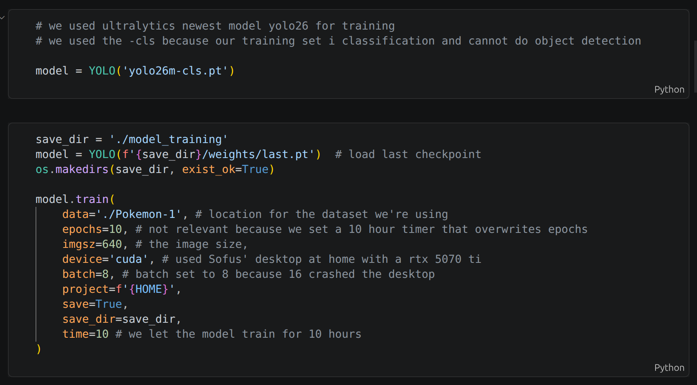
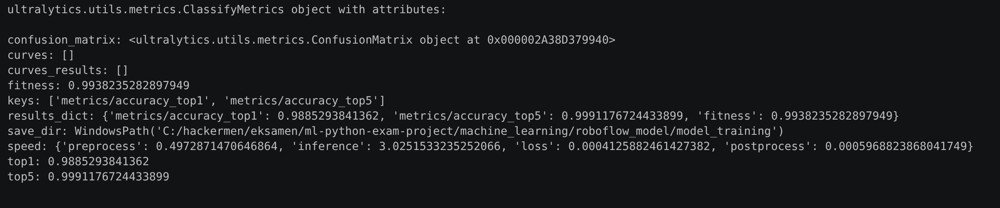
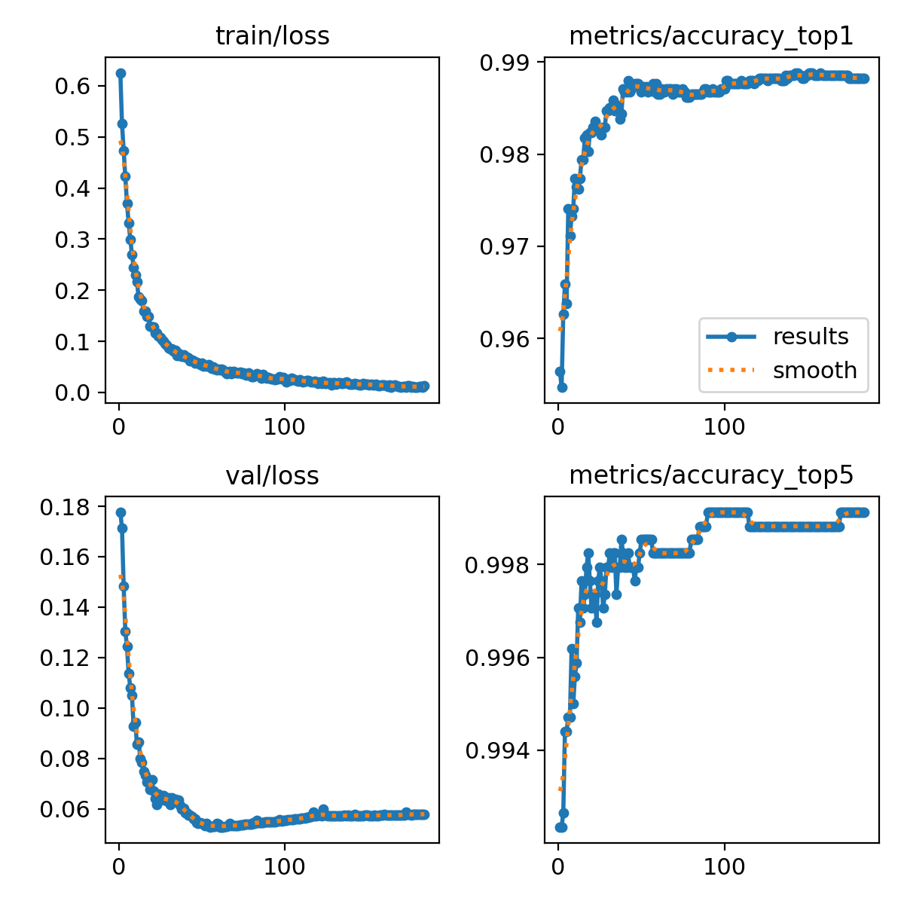
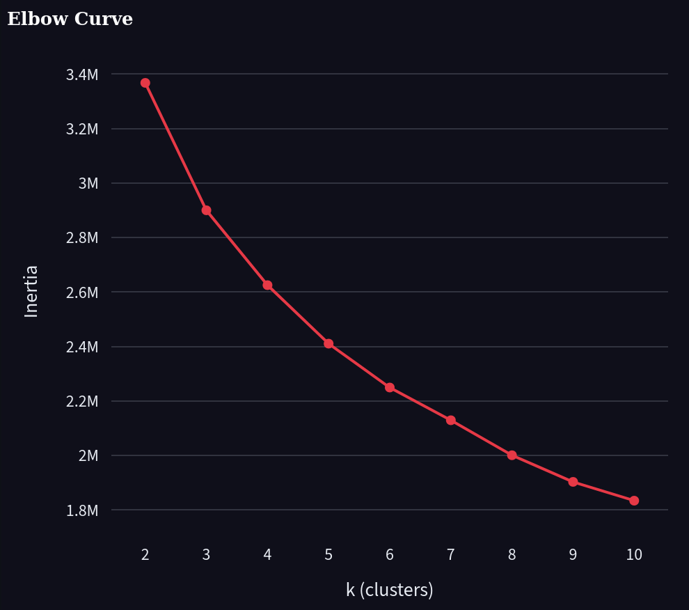
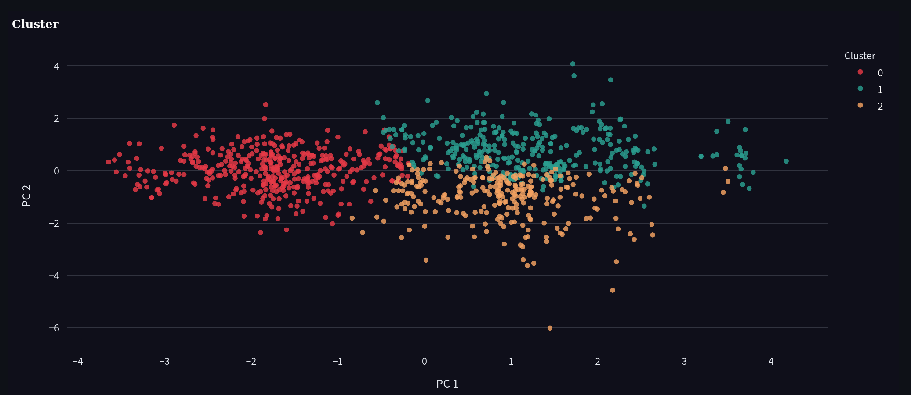
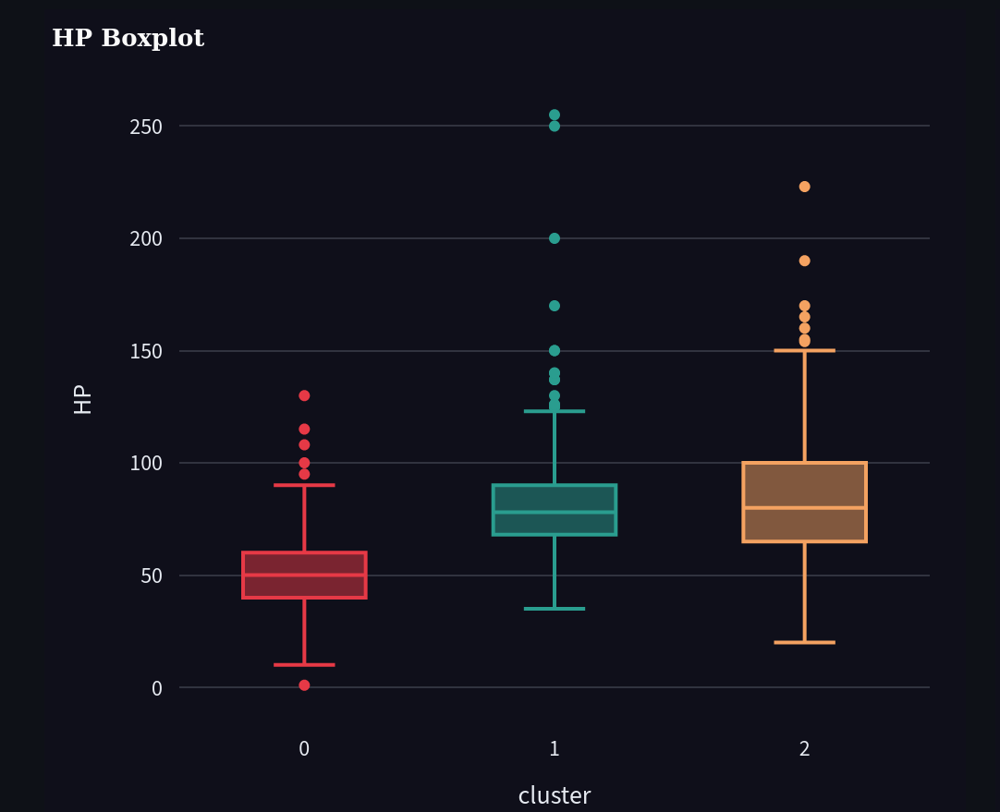
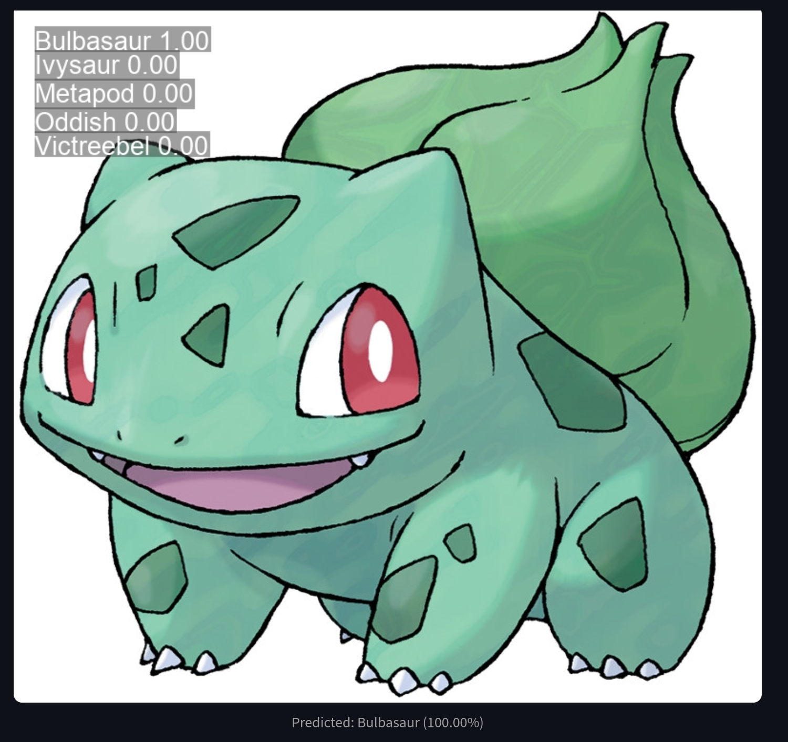

# Pokedex exam project
This pokedex is made for the EK python and machine learning exams summer 2026

Made by: [Gustav](https://github.com/GusViking), [Sofus](https://github.com/SofusVingaard) and [Tobias](https://github.com/itsHarning)

jump to:

[Installation](#installation)

[Usage](#usage)

[Machine Learning](#machine-learning)

## Installation
If you have docker installed, you can run `docker compose up --build` in the root of the project to run everything

If not, to install requirements you can use

```bash
# If you have uv installed
uv sync

# If uv isn't installed, use pip
pip install -r requirements.txt
```
then use the following to run the application
```bash
# To run the api use 
uvicorn python.fastApi.PokeAPI:app --reload

# To run the streamlit use 
streamlit run ./python/streamlit/pokedex.py
```

## Usage
### Pokedex
On the pokedex page you can choose a Pokémon from the dropdown menu, or click on any of the text of the Pokémon to go to a more detailed page with a handful of stats about it.

### Clustering
View interesting clustering info about specific stats.

### Chat with Pikachu
Chat with Pikachu using mistral API

### Recognise Pokémon
Upload an image of a Pokémon from generation 1, and our AI will tell you what Pokémon it is


# Machine Learning

For machine learning the main files are:

- `machine_learning/roboflow_model/PokemonGenOneModel.ipynb` — The Jupyter notebook that we used to train our roboflow yolo model
- `machine_learning/plotting.ipynb` — We used a jupyter notebook file at first to see clustering and easily change variables
- `python/streamlit/functions/ClusterFunctions.py` - 
This file contains the functions we use to show the clusters and other graphs we show on our streamlit frontend
- `python/streamlit/functions/model_predict.py` - 
The function our frontend uses when we upload a picture. It uses our trained model to return what pokemon picture has been uploaded.


### Our model, training params and training data
The params we used to train our model


Our top1 and top5 accuracy



We can see that our model got increasingly more accurate the more epochs it ran



### clustering

We test k-means to see how many clusters are optimal for our dataset

- In our dataset around 3 clusters is ideal

our clustering with 3 clusters. In our webapp it's possible to change how many clusters there are


We have included a boxplot using a specific stat which showcases the upper and lower fences and the means of each cluster


### Pokemon recogniser 
Our trained model takes a picture and can tell what pokemon is in the picure
Since our model is a classification model it can not tell us all the pokemon in the picture, but tells us what pokemon is has the highest confidence in
